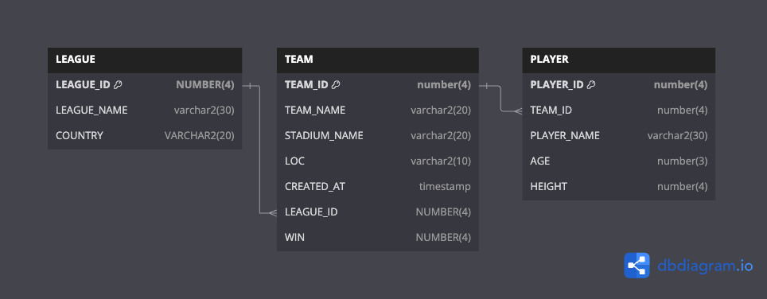

## 미니프로젝트(개인)

### 프로젝트 명세서
- 프로젝트 명 : FMS(Football Management System)
- 프로젝트 인원 : 1명
- 운영체제 : Mac OS(Sonoma 14.4.1)
- 프로그래밍 언어 : Java(Oracle OpenJDK 17.0.9)
- 빌드도구 : Gradle
- 데이터베이스 : Oracle Database → Colima 위에 Oracle DB 띄움
- 외부 라이브러리 및 모듈
    - Oracle Jdbc Driver 11
- IDE : IntelliJ Ultimate Edition
- 형상관리 도구 : Git & Github
- 구현 기능
  - 선수 등록, 탈퇴, 수정, 조회
  - 팀 등록, 탈퇴, 수정 조회
  - 리그 등록, 탈퇴

### DB Diagram
