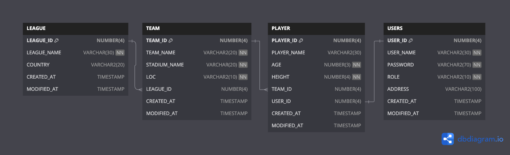

## 미니프로젝트(개인)

### 프로젝트 명세서
- 프로젝트 명 : FMS(Football Management System)
- 프로젝트 인원 : 1명
- 운영체제 : Mac OS(Sonoma 14.4.1)
- 프로그래밍 언어 : Java(Oracle OpenJDK 17.0.9)
- 빌드도구 : Gradle
- 데이터베이스 : Oracle Database(Docker)
- 외부 라이브러리 및 모듈
    - Oracle Jdbc Driver 11
    - 
- IDE : IntelliJ Ultimate Edition
- 형상관리 도구 : Git & Github
- 구현 기능
  - ~~회원가입(Users테이블) -> Admin(관리자)/Player(선수)을 컬럼으로 구분하여 회원 저장~~
  - 로그인/로그아웃 -> Java 코드 내에서 분기하여 로직구성
  - 선수 등록, 탈퇴, 수정, 조회 -> Users(Player) 만 가능
  - 팀 등록, 탈퇴, 수정 조회 -> Users(Admin) 만 가능
  - 리그 등록, 탈퇴 -> Users(Admin) 만 가능
  - 코드 리팩토링

### DB Diagram

> [더미 데이터 및 테이블 세팅 쿼리](src/sql/table.sql)